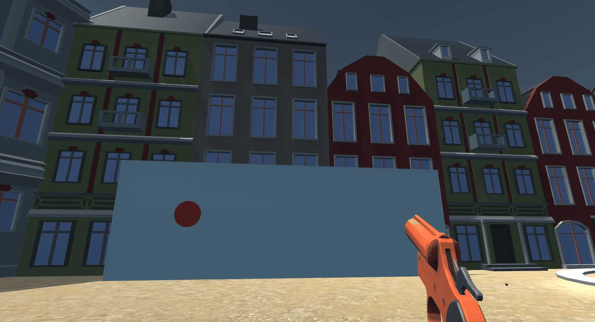

# Serious game simulating alcohol effects in Unity with augmented reality and sound management
 In collaboration with [@souliera](https://github.com/souliera)

## Steps of development 

### Alcohol effects

Alcohol is simulated with a combinaison of post-processing effects such as Motion blur, Distorsion, Vigneting...

Balance loss is also integrated with a random movement generated with a *Perlin noise function*.

### Pistol

### Targets

### And more to come very soon!
